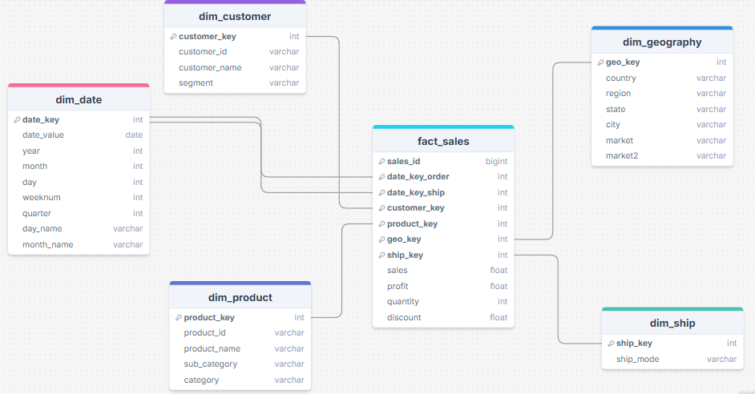
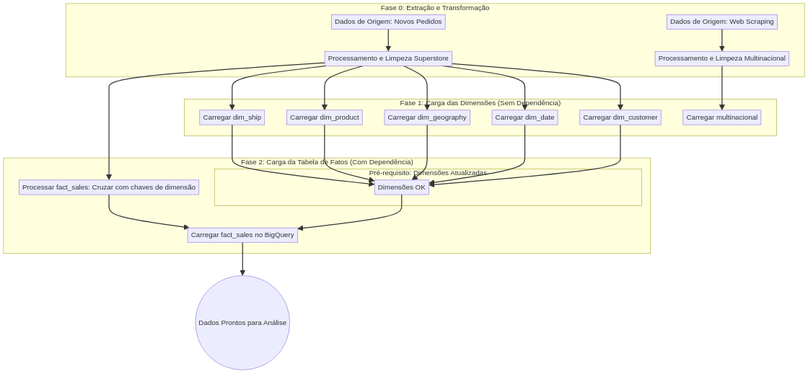

# ETL SuperStore

   

Este projeto implementa um **pipeline ETL (Extract, Transform, Load) completo** para o dataset SuperStore, estruturando dados em um modelo dimensional (Star Schema) no BigQuery e preparando-os para análise de negócios avançada.

## 📋 Visão Geral do Projeto

O projeto SuperStore visa criar uma infraestrutura robusta de dados que consolida informações de vendas de múltiplas fontes em um data warehouse centralizado. Através de um processo ETL bem estruturado, os dados são extraídos, transformados conforme padrões de qualidade rigorosos e carregados em tabelas dimensionais otimizadas para análise.

**Objetivos Alcançados:**
- ✅ Estrutura Star Schema com 7 tabelas (5 dimensões + 1 fato + 1 auxiliar)
- ✅ 51.290 registros de vendas processados e validados
- ✅ 371 empresas multinacionais integradas via web scraping
- ✅ Limpeza conceitual de dados (nulos, duplicados, padronização)
- ✅ Pipeline de atualização projetado com dependências definidas
- ✅ Dados prontos para análise de Business Intelligence


## 📂 Estrutura do Projeto

```
ETL-SuperStore/
├── data/
│   ├── raw/                         
│   │   ├── superstore_raw.csv       
│   │   └── multinacional_raw.csv    
│   └── processed/                    
│       ├── superstore_final.csv     
│       └── multinacional_final.csv  
├── notebooks/                        
│   └── etl_superstore.ipynb         
├── src/                            
│   └── load_data.py                
├── requirements.txt                 # Dependências Python
└── README.md                        # Este arquivo
```

## 🏗️ Arquitetura de Dados (Star Schema)

O projeto implementa um modelo dimensional **Star Schema** com a seguinte estrutura:

### Tabela de Fatos: **FatoVendas**
Contém as métricas de negócio agregadas por transação:

| Coluna | Tipo | Descrição |
| :--- | :--- | :--- |
| `sales_id` | INT64 | Chave primária (identificador único da venda) |
| `date_key_order` | INT64 | FK → DimData (data do pedido) |
| `date_key_ship` | INT64 | FK → DimData (data de envio) |
| `customer_key` | INT64 | FK → DimCliente |
| `product_key` | INT64 | FK → DimProduto |
| `geo_key` | INT64 | FK → DimGeografia |
| `ship_key` | INT64 | FK → DimEnvio |
| `sales` | FLOAT64 | Receita da venda |
| `profit` | FLOAT64 | Lucro da venda |
| `quantity` | INT64 | Quantidade de itens |
| `discount` | FLOAT64 | Desconto aplicado |

### Tabelas de Dimensão

#### **DimData** - Dimensão Temporal
Contém informações de datas para análise temporal:
- `date_key` (PK), `order_date`, `ship_date`, `year`, `month`, `day`, `weeknum`

#### **DimCliente** - Dimensão de Clientes
Informações únicas de cada cliente:
- `customer_key` (PK), `customer_id`, `customer_name`, `segment`

#### **DimProduto** - Dimensão de Produtos
Detalhes dos produtos comercializados:
- `product_key` (PK), `product_id`, `product_name`, `category`, `sub_category`

#### **DimGeografia** - Dimensão Geográfica
Localização das vendas:
- `geo_key` (PK), `country`, `region`, `state`, `city`, `market`, `market2`

#### **DimEnvio** - Dimensão de Envio
Modos de envio disponíveis:
- `ship_key` (PK), `ship_mode`

#### **Multinacional** - Dimensão Auxiliar
Dados de empresas concorrentes (web scraping):
- `company_id` (PK), `company`, `headquarters`, `countries`, `locations`, `employees`



## 🚀 Configuração do Ambiente

1. Clone o repositório:
```bash
git clone https://github.com/iannacastro/ETL-SuperStore.git
cd ETL-SuperStore
```

2. Crie e ative um ambiente virtual:
```bash
python -m venv venv
source venv/bin/activate  # Linux/macOS
.\venv\Scripts\activate   # Windows
```

3. Instale as dependências:
```bash
pip install -r requirements.txt
```

## 💻 Como Usar

1. Para carregar e visualizar os dados:
```bash
python src/load_data.py
```

2. Para análises interativas, abra o notebook Jupyter:
```bash
jupyter notebook notebooks/etl_superstore.ipynb
```

## 🛠️ Tecnologias Utilizadas

- Python 3.x
- Pandas para manipulação de dados
- Google BigQuery para armazenamento
- Jupyter Notebooks para análise interativa
- Bibliotecas auxiliares (requirements.txt)

## 📦 Dependências Principais

- pandas
- numpy
- python-dotenv
- pandas-gbq
- jupyter
- beautifulsoup4

## 📈 Pipeline de Atualização de Dados

O projeto define uma estratégia de atualização que respeita as dependências do modelo dimensional:




## 📝 Licença

Este projeto está sob a licença MIT. Veja o arquivo [LICENSE](LICENSE) para mais detalhes.

---
* Desenvolvido por [iannacastro](https://github.com/iannacastro)
* **Última atualização:** Outubro 2025
* **Link apresentação:** [ROTA 1 - ETL](https://www.canva.com/design/DAG2YNHSejk/-Vgk4uGZz33JeOkXUKJ7kA/edit?utm_content=DAG2YNHSejk&utm_campaign=designshare&utm_medium=link2&utm_source=sharebutton)
* **Status:** ✅ Projeto Completo
